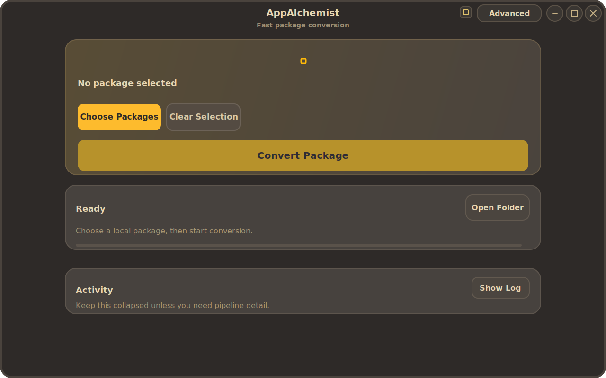

# AppAlchemist

AppAlchemist converts Linux application packages into portable AppImage bundles.



It is built for the practical workflow:

1. choose a package
2. convert it
3. run the resulting AppImage

The current frontend uses GTK4/libadwaita, and the same backend is also available through the CLI for batch and scripted conversion.

## Why AppAlchemist

Linux applications are still distributed in many incompatible formats. AppAlchemist exists to reduce that friction.

Instead of manually unpacking packages, chasing libraries, fixing launchers, and rebuilding desktop files, the tool tries to produce a single portable AppImage from the package you already have.

The goal is practical portability, not theoretical perfection:

- keep the UI minimal and fast for normal users
- keep the CLI useful for repeatable conversion workflows
- make converted apps integrate cleanly with the desktop when possible

## What It Supports

- `.deb`
- `.rpm`
- archive-style packages such as `.tar.gz`, `.tar.xz`, `.zip` when they contain a usable Linux app layout
- desktop integration for produced AppImages
- automatic icon extraction and `.desktop` generation
- dependency bundling and compatibility fixes for many common desktop apps

## What It Does

AppAlchemist extracts the source package, detects the main executable, resolves runtime requirements, builds an AppDir, and then packages the result as an AppImage.

It includes logic for common application layouts, including:

- native desktop apps
- Electron/Chromium-style packages
- Python applications
- Java applications
- apps installed under `/opt`

## Current Focus

The project is optimized around end-user productivity:

- minimal GTK interface focused on `choose package -> convert`
- secondary options kept out of the way
- CLI support for direct conversion and automation

## Install

### AppImage

Download the latest release from the GitHub Releases page:

- [Releases](https://github.com/maksimkaosipov75-design/AppAlchemist/releases)

Make it executable and run it:

```bash
chmod +x appalchemist-1.5.0-x86_64.AppImage
./appalchemist-1.5.0-x86_64.AppImage
```

If FUSE is unavailable, use the fallback launcher shipped in local builds:

```bash
./releases/run-appalchemist.sh
```

### From Source

Requirements:

- CMake 3.15+
- C++20 compiler
- Qt6 development packages
- GTK4 and libadwaita development packages
- standard packaging utilities available on your distro

Build:

```bash
cmake -S . -B build -DCMAKE_BUILD_TYPE=Release
cmake --build build -j$(nproc)
```

Run:

```bash
./build/appalchemist
```

## Release Notes

Latest published GitHub release:

- `v1.5.0`

Current GitHub release page:

- [AppAlchemist Releases](https://github.com/maksimkaosipov75-design/AppAlchemist/releases)

Important note:

- the repository release tag is currently `v1.5.0`
- the local packaging script still names the generated AppImage as `1.1.0`
- this naming mismatch is a packaging/versioning cleanup item, not a missing binary

## Usage

### GTK UI

Launch the app:

```bash
./build/appalchemist
```

Main workflow:

1. drag and drop a package, or click `Choose Packages`
2. review output folder and optional advanced settings
3. click `Convert Package`

### CLI

Convert one package:

```bash
./build/appalchemist --convert path/to/package.deb --no-launch
```

Examples:

```bash
./build/appalchemist --convert path/to/package.rpm
./build/appalchemist --convert path/to/archive.tar.gz --no-launch
./build/appalchemist --convert path/to/archive.zip --output ~/AppImages
```

Batch conversion:

```bash
./build/appalchemist --batch file1.deb file2.rpm file3.tar.gz --no-launch
```

## Output

By default, converted AppImages are written to a user output directory such as `~/AppImages`.

AppAlchemist also creates desktop integration entries for produced AppImages, including:

- launcher `.desktop` files in `~/.local/share/applications`
- icons in `~/.local/share/icons/hicolor`

## Tested Conversion Cases

Recent work in the project specifically improved launcher and icon handling for real-world desktop apps, including:

- Chrome-style packages that ship both visible and hidden `.desktop` entries
- `/opt`-based applications such as `v2rayN`
- archive-based app layouts covered by the regression corpus

The seeded regression manifest currently lives in:

- [docs/regression-corpus.md](docs/regression-corpus.md)
- [docs/regression-corpus.json](docs/regression-corpus.json)

## Packaging

Build a distributable AppImage:

```bash
bash packaging/build-appimage.sh
```

Expected output:

- `releases/appalchemist-1.1.0-x86_64.AppImage` from the current packaging script

GitHub releases may publish the same binary under a newer release tag name such as `v1.5.0`.

Other packaging scripts:

```bash
bash packaging/build-appimage-arm64.sh
bash packaging/build-deb.sh
bash packaging/build-rpm.sh
```

See also:

- [packaging/README.md](packaging/README.md)
- [packaging/BUILD_ALL.md](packaging/BUILD_ALL.md)

## How It Works

At a high level, AppAlchemist performs these stages:

1. extract the source package
2. classify the application layout
3. detect the main executable and runtime profile
4. apply compatibility fixes when needed
5. build an AppDir with bundled dependencies
6. generate a final AppImage

## Project Layout

- [src](src): conversion backend
- [include](include): headers and shared interfaces
- [frontend/gtk](frontend/gtk): GTK4/libadwaita frontend
- [packaging](packaging): release scripts
- [docs](docs): roadmap and project notes

## Limitations

AppAlchemist improves portability, but conversion is not magic. Some packages still need manual review, especially:

- applications with unusual runtime launchers
- packages that depend on system daemons or kernel features
- packages with missing or broken upstream desktop metadata
- apps that intentionally rely on distro-specific integration

For that reason, each conversion should be treated as a build artifact that may still need smoke-testing.

## Troubleshooting

### App does not start after conversion

- inspect the activity log in the UI
- run conversion from the CLI to get clearer output
- test the generated AppImage directly from a terminal

### App does not appear in the application menu

- verify the generated launcher in `~/.local/share/applications`
- check whether your desktop environment needs a refresh of its app cache

### Wrong icon is shown

- remove stale launchers and reconvert
- verify the package actually contains a usable application icon
- check whether an old launcher in `~/.local/share/applications` is shadowing the new one

### Conversion fails

- confirm the input package is valid
- confirm you have enough disk space
- retry with `--no-launch` so the conversion step is isolated from runtime launch issues

## License

MIT. See [LICENSE](LICENSE).
