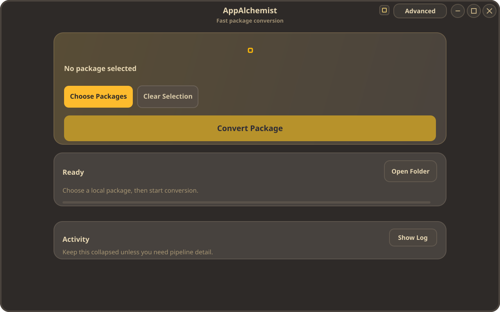

# AppAlchemist

Turn Linux packages into portable AppImages.

[](https://github.com/maksimkaosipov75-design/AppAlchemist/releases/latest)
[](https://github.com/maksimkaosipov75-design/AppAlchemist/actions/workflows/build-arm64.yml)
[](LICENSE)


[Download latest AppImage](https://github.com/maksimkaosipov75-design/AppAlchemist/releases/latest)



## What Is AppAlchemist?

AppAlchemist converts `.deb`, `.rpm`, `.tar.gz`, `.tar.xz` and `.zip` application packages into AppImage bundles using a GTK interface or a CLI workflow.

It extracts the source package, detects the app launcher and icon, builds an AppDir, bundles runtime dependencies where possible, and produces a portable AppImage artifact.

## Why Use It?

Linux apps are still distributed in many package formats. AppAlchemist gives users and maintainers a practical path from a distro package or Linux app archive to a single runnable AppImage.

The goal is practical portability, not magic. Some packages still need manual review, especially when they depend on system daemons, kernel features, or unusual launch scripts.

## Features

- Convert `.deb` packages to AppImage
- Convert `.rpm` packages to AppImage
- Convert Linux application archives to AppImage
- GTK4/libadwaita graphical interface
- CLI mode for automation
- Desktop launcher detection
- Icon detection and integration
- Basic dependency bundling
- AppDir generation

## Supported Input Formats

| Format | Status | Notes |
|---|---:|---|
| `.deb` | Supported | Best tested |
| `.rpm` | Supported | Depends on package layout |
| `.tar.gz` | Supported | Requires usable Linux app structure |
| `.tar.xz` | Supported | Requires usable Linux app structure |
| `.zip` | Supported | Requires usable Linux app structure |

## Quick Start

1. Download the latest AppImage from [Releases](https://github.com/maksimkaosipov75-design/AppAlchemist/releases/latest).
2. Make it executable.
3. Run AppAlchemist.
4. Select an input package.
5. Choose an output directory.
6. Convert and run the generated AppImage.

Releases carry a build per architecture: `x86_64` for a normal PC and
`aarch64` for ARM hardware.

```bash
chmod +x appalchemist-1.6.0-x86_64.AppImage
./appalchemist-1.6.0-x86_64.AppImage
```

If FUSE is unavailable on your system:

```bash
APPIMAGE_EXTRACT_AND_RUN=1 ./appalchemist-1.6.0-x86_64.AppImage
```

## GUI Usage

```bash
./build/appalchemist-gui
```

The main GUI flow is:

1. Select or drop a package.
2. Review the output directory.
3. Start conversion.
4. Check the conversion log.
5. Smoke-test the generated AppImage.

More details: [docs/usage-gui.md](docs/usage-gui.md).

## CLI Usage

`appalchemist-cli` is a standalone headless binary: it links only against the
core conversion library and has no GTK, libadwaita or Qt GUI dependency, so it
runs on servers and inside CI containers.

```bash
./build/appalchemist-cli ./example.deb --output ./dist --no-launch
```

Useful commands:

```bash
./build/appalchemist-cli --help
./build/appalchemist-cli --version
./build/appalchemist-cli --convert ./example.rpm --output ./dist
./build/appalchemist-cli --dry-run ./example.deb            # validate only
./build/appalchemist-cli --json ./example.deb -o ./dist     # NDJSON events
./build/appalchemist-cli --quiet ./example.deb -o ./dist    # nothing on stdout
./build/appalchemist-cli --batch ./one.deb ./two.rpm --output ./dist --no-launch
```

### Automation contract

| Aspect | Behaviour |
|---|---|
| `stdout` | The generated AppImage path; with `--json`, one NDJSON event per line; with `--quiet`, nothing at all |
| `stderr` | All logs, warnings and error messages |
| exit `0` | Conversion succeeded (or `--dry-run` validation passed) |
| exit `1` | Conversion failed (bad package, extraction or build error) |
| exit `2` | Usage error (unknown option, no input file) |

`--dry-run` validates the package and resolves its dependencies without
building an AppDir or invoking `appimagetool`, which makes it usable as a cheap
pre-flight check in pipelines.

NDJSON events look like this:

```json
{"event":"progress","message":"Extracting .deb package...","percent":20,"percentage":20}
{"event":"complete","output":"/dist/Example.AppImage","success":true}
```

More details: [docs/usage-cli.md](docs/usage-cli.md).

## Tested Packages

The regression corpus documents packages and layouts used to check launcher, icon, and archive handling:

- [docs/regression-corpus.md](docs/regression-corpus.md)
- [docs/regression-corpus.json](docs/regression-corpus.json)
- [docs/supported-packages.md](docs/supported-packages.md)

## Installation

The recommended installation path for normal users is the latest AppImage from GitHub Releases.

Additional packaging helpers are available under [packaging](packaging):

```bash
bash packaging/build-appimage.sh
bash packaging/build-appimage-arm64.sh
bash packaging/build-deb.sh
bash packaging/build-rpm.sh
```

## Build From Source

Requirements:

- CMake 3.22+
- C++20 compiler
- Qt6 Core and Network development packages
- GTK4 (>= 4.10) and libadwaita (>= 1.5) development packages (GUI only)
- libarchive and libzstd development packages (in-process archive extraction)
- `pkg-config`
- standard packaging utilities available on your distro

Build:

```bash
cmake -S . -B build -DCMAKE_BUILD_TYPE=Release
cmake --build build -j$(nproc)
```

The build produces three targets:

| Target | Kind | Notes |
|---|---|---|
| `appalchemist_core` | static library | Conversion pipeline, no GUI dependencies |
| `appalchemist-cli` | executable | Headless converter, no GTK dependencies |
| `appalchemist-gui` | executable | GTK4/libadwaita frontend |

Installing also puts `appalchemist` on `PATH`. It is the product's command
name and forwards to the right binary: a conversion request such as
`appalchemist --convert app.deb` runs headlessly, while `appalchemist` on its
own opens the interface. Desktop entries and MIME handlers use it too.

Build options: `-DBUILD_CLI=OFF`, `-DBUILD_GUI=OFF`, `-DENABLE_TESTS=OFF`,
`-DENABLE_SANITIZERS=ON` (AddressSanitizer + UndefinedBehaviorSanitizer).
Building only the CLI on a headless machine needs no GTK at all:

```bash
cmake -S . -B build -DCMAKE_BUILD_TYPE=Release -DBUILD_GUI=OFF
```

Run:

```bash
./build/appalchemist-gui       # graphical interface
./build/appalchemist-cli --help
```

## Tests

The Catch2 v3 suite covers package parsing, extraction security (path
traversal, hardlink/symlink escapes, decompression quotas), dependency
staging, AppDir assembly, the CLI contract, and an end-to-end pipeline run.
Standalone stress harnesses for AppRun sanitization and conversion
cancellation run as part of the same CTest suite:

```bash
cmake -S . -B build -DCMAKE_BUILD_TYPE=Release
cmake --build build -j$(nproc)
ctest --test-dir build --output-on-failure
```

The same suite under AddressSanitizer and UndefinedBehaviorSanitizer:

```bash
cmake -S . -B build-asan -DCMAKE_BUILD_TYPE=Debug -DENABLE_SANITIZERS=ON
cmake --build build-asan -j$(nproc)
ctest --test-dir build-asan --output-on-failure
```

CI (`.github/workflows/ci.yml`) runs these tests and a real RPM-to-AppImage
conversion smoke test on every push and pull request.

## Troubleshooting

### Conversion Fails

- Confirm the input package is valid.
- Retry from the CLI with `--no-launch` so conversion is isolated from app startup.
- Run `appalchemist-cli --dry-run <package>` to check whether the package itself parses and resolves.
- Check the conversion log for missing libraries, missing launchers, or AppDir layout problems.
- Report reproducible failures with the conversion failure issue template.

### Generated AppImage Does Not Start

- Run the generated AppImage from a terminal.
- Check whether the source app depends on system daemons or distro-specific services.
- Confirm FUSE is available, or retry with `APPIMAGE_EXTRACT_AND_RUN=1`.

### Wrong Launcher Or Icon

- Remove stale launchers from `~/.local/share/applications`.
- Confirm the source package contains a usable `.desktop` file and icon.
- Reconvert and check the generated AppDir.

## Roadmap

- Expand the public regression corpus with real-world package results.
- Improve dependency diagnostics in conversion logs.
- Keep the GTK UI focused on package selection, conversion status and actionable errors.
- Add release checks for x86_64 and ARM64 AppImage builds.

## Contributing

Contributions are welcome. Start with [CONTRIBUTING.md](CONTRIBUTING.md), and use the conversion failure issue template when reporting packages that do not convert cleanly.

## Security

AppAlchemist processes third-party packages and archives. Treat input packages and generated AppImages as untrusted unless you trust the source. See [SECURITY.md](SECURITY.md).

## License

MIT. See [LICENSE](LICENSE).
